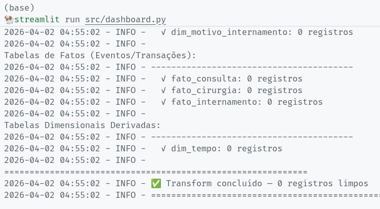

<div align="center">

<!-- LOGO / BANNER -->


<br/>
<br/>

<!-- BADGES -->


<br/>

# etl-lar

### *An ETL pipeline aimed at automating and visualization of hospital statistical data, taking as its case study the National Ophthalmology Institute of Angola.*

<br/>

<!-- LINKS 
[**Live Demo**](https://your-demo-url.com) &nbsp;·&nbsp;
[**Documentation**](https://your-docs-url.com) &nbsp;·&nbsp;
-->
[**Report Bug**](https://github.com/fevunge/etl-lar/issues) &nbsp;·&nbsp;
[**Request Feature**](https://github.com/fevunge/etl-lar/issues)

</div>

---

## 📋 Table of Contents

- [Overview](#-overview)
- [Features](#-features)
- [Tech Stack](#-tech-stack)
- [Getting Started](#-getting-started)
  - [Prerequisites](#prerequisites)
  - [Installation](#installation)
  - [Environment Variables](#environment-variables)
- [Usage](#-usage)
- [Project Structure](#-project-structure)
- [API Reference](#-api-reference)
- [Screenshots](#-screenshots)
- [Roadmap](#-roadmap)
- [Contributing](#-contributing)
- [License](#-license)
- [Authors](#-authors)
- [Acknowledgements](#-acknowledgements)

---

## Overview

> **ETL-lar** is a comprehensive ETL (Extract, Transform, Load) pipeline designed to automate the processing and visualization of hospital statistical data. The project focuses on the National Ophthalmology Institute of Angola, aiming to streamline data management and provide actionable insights through interactive dashboards. By leveraging modern technologies and best practices in data engineering, ETL-lar enables healthcare professionals to make informed decisions based on accurate and timely data.

---

## Features

- **Data Extraction**: Implement robust data extraction mechanisms to pull data from various sources, including databases, APIs, and flat files.
- **Data Transformation**: Develop a flexible transformation layer to clean, normalize, and enrich the
    extracted data, ensuring it is in the correct format for analysis and visualization.
- **Data Loading**: Set up efficient loading processes to store the transformed data in a centralized data warehouse, optimizing for query performance and scalability.
- **Visualization**: Create interactive dashboards and reports that allow users to explore the data, identify trends, and derive insights relevant to ophthalmology care and hospital management.
- **Automation**: Schedule and automate the entire ETL process to ensure that the data is always up-to-date, reducing manual intervention and minimizing errors.
- **Extract to CSV, XLSX, SQL**: Implement functionality to export the processed data into various formats such as CSV, XLSX, and SQL for further analysis or sharing with stakeholders.


---

## Tech Stack

| Layer | Technology |
|---|---|
| **Dashboard** | Streamlit (version 1.55.0) |
| **Backend** | Python (3.13.9) |
| **Post-Processing** | Pandas, NumPy |
| **Database** | MySQL |
| **Data Visualization** | Power BI |
| **DevOps** | Docker, Git |


---

## Getting Started

### Prerequisites

This Python project dependencies:


- **`pandas`**`>=2.2.0`  

- **`numpy`**`>=1.26.0`  

- **`SQLAlchemy`**`>=2.0.0`  

- **`PyMySQL`**`>=1.1.0`  

- **`openpyxl`**`>=3.1.0`  

- **`python-dotenv`**`>=1.0.0`  

- **`streamlit`**`>=1.34.0`  

- **`altair`**`<5`  


### Installation

**1. Clone the repository**

```bash
git clone https://github.com/fevunge/etl-lar.git
cd etl-lar
```

**2. Install dependencies**

If you are using Linux, macOS, WSL or another Unix-like system, is highly recommended to use a **virtual environment** to manage dependencies.  

You can create one using `venv`:
```bash
python -m venv venv
source venv/bin/activate
```
Otherwise, if you are a experienced Windows user, you decide create a **virtual environment** or not.

```bash
pip install -r requirements.txt
```

**3. Set up environment variables**

```bash
cp .env.example .env
```

**4. Run database**

 - #### Unix-like systems (use docker):
```bash
  docker compose up -d
```

- #### Windows (Options):
  - Install MySQL/MySQL Workbench and create a database named `etl_lar` on Workbench interface.

  - Use Docker Desktop to download and run MySQL image, then create a database named `etl_lar` on MySQL Workbench interface or using MySQL CLI (**RECOMMENDED**).

  - Use WSL to run the same commands as Unix-like systems.

**5. Start the development server**

 - Command Line Interface:
```bash
  python src/main.py
```

- Dashboard Interface:
```bash
  python -m streamlit run src/dashboard.py
```
By _default_, the dashboard will be available at [`http://localhost:8501`](http://localhost:8501).  
You can change the port by adding `--server.port <PORT_NUMBER>` to the command above.  
Or it can change automatically if the default port is already in use.


---

### Environment Variables

Create a `.env` file in the root directory. See [`.env.example`](./.env.example) for reference.

| Variable | Description | Required |
|---|---|---|
| `DB_HOST` | MySQL Database host (e.g `0.0.0.0`) | ✅ |
| `DB_PORT` | MySQL Database port (e.g `3306`) | ✅ |
| `DB_USER` | MySQL Database username (e.g `root`) | ✅ |
| `DB_PASSWORD` | MySQL Database password | ✅ |
| `DB_NAME` | MySQL Database name (e.g `etl_lar`) | ✅ |

With are you using Docker, this variables are already set in `docker-compose.yml`, you must have the same values in your `.env` file to connect to the database container.

---

## Usage

...  Soon ...

---

## 📁 Project Structure

```
etl-lar
├── data_raw
│   ├── cirurgias.csv
│   ├── consultas.csv
│   ├── exames_complementares.csv
│   ├── exames_laboratoriais.csv
│   ├── farmacia_consumo.csv
│   ├── internamentos.csv
│   ├── medicos.csv
│   ├── pacientes.csv
│   └── patologias.csv
├── logs
│   └── etl.log
├── src
│   ├── config.py
│   ├── dashboard.py
│   ├── export.py
│   ├── extract.py
│   ├── load.py
│   ├── logs.py
│   ├── main.py
│   └── transform.py
├── .env.example
├── .gitignore
├── etlar.cmd
├── etllar.sh
├── LICENSE
├── Makefile
├── README.md
├── requirements.txt
└── SPEC.md
```

---

## API Reference

### `extract_data()`
Extracts data from the source files and returns a dictionary of DataFrames.
**Returns:**
- `Dict[str, pd.DataFrame]`: A dictionary where keys are table names and values are the corresponding DataFrames.

### `transform_data(data: Dict[str, pd.DataFrame])`
Transforms the extracted data by performing cleaning, normalization, and enrichment operations.
**Parameters:**
- `data (Dict[str, pd.DataFrame])`: A dictionary of DataFrames to be transformed.
**Returns:**
- `Dict[str, pd.DataFrame]`: A dictionary of transformed DataFrames.

### `load_data(data: Dict[str, pd.DataFrame])`
Loads the transformed data into the MySQL database.
**Parameters:**
- `data (Dict[str, pd.DataFrame])`: A dictionary of DataFrames to be loaded into the database.

---

## 📸 Screenshots

<div align="center">


*ETL process logs*

</div>

---

## Roadmap

... Soon ...

---

## Contributing

### ❌ Contributions are not accepted at this time.   
Please check back later for updates on how to contribute to this project.

---

## License

Distributed under the **MIT License**.

---

## Authors

<div align="center">

|  |
|:---:|
| **Fernando Vunge** |
| [](https://github.com/fevunge) [](https://linkedin.com/in/fevunge) [](https://twitter.com/fevunge) |

</div>

---

## Acknowledgements

- [Power BI](https://powerbi.microsoft.com/) — Data visualization tool
- [Streamlit](https://streamlit.io/) — Dashboard framework
- [MySQL](https://www.mysql.com/) — Database management system
- [Pandas](https://pandas.pydata.org/) — Data manipulation library
- [NumPy](https://numpy.org/) — Numerical computing library
- [SQLAlchemy](https://www.sqlalchemy.org/) — SQL toolkit and Object-Relational Mapping (ORM) library
- [PyMySQL](https://pymysql.readthedocs.io/) — MySQL client library
- [openpyxl](https://openpyxl.readthedocs.io/) — Excel file handling library

---

<div align="center">

Made with 🧠 and ☕ by [fevunge](https://github.com/fevunge)

⭐ **Star this repo** if you found it insightful!

</div>
